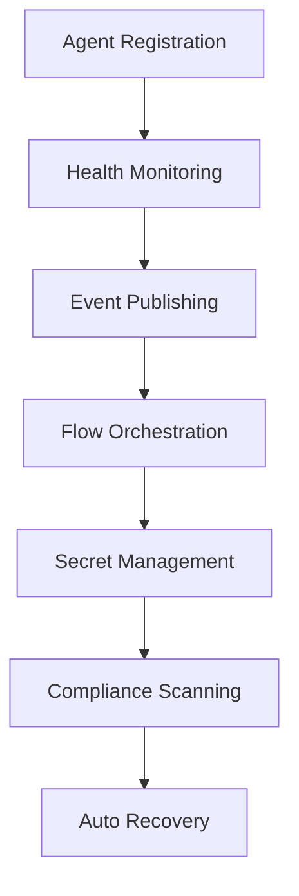

# YUR Agent Framework 🤖

[](../LICENSE)
[](https://www.typescriptlang.org/)
[](https://nodejs.org/)

Production-ready agent framework with health monitoring, self-registration, permissions, flow control, event-driven orchestration, and comprehensive security features.

## 🌟 Features

### 1. Agent Health API ✅
All agents implement a standardized `health()` method returning `{ healthy: boolean, reason?: string }` with detailed metrics, enabling universal monitoring and auto-recovery systems.

### 2. Agent Self-Registration ✅
On startup, agents automatically register themselves in a central registry with both in-memory and persistent file storage, enabling plugin architectures and hot-reload capabilities.

### 3. Agent Permissions/Sandboxing ✅
Agents declare and enforce allowed tasks, secrets, and event topics. The central runtime denies unauthorized actions and maintains comprehensive audit logs of violations.

### 4. Conditional/Dynamic Flow Steps ✅
Flow runner supports if/else conditions, retries with exponential backoff, branching logic, and looping constructs. YAML/JSON flows can express complex conditions, guards, and dynamic branching.

### 5. Output Piping ✅
Flow runner enables later steps to reference outputs of previous steps using `{{steps.myStep.result}}` syntax, enabling complex, data-driven agent pipelines.

### 6. Event-Driven Orchestration ✅
OrchestratorAgent listens for events (e.g., `build.failed`) and triggers flows automatically with full event-bus integration and topic-based routing.

### 7. Per-Secret Access Controls ✅
SecretsAgent enforces granular per-agent access control with comprehensive audit logging of all secret reads/writes, automatically denying violations.

### 8. Secrets Scanning ✅
ComplianceAgent scans repositories and PRs for leaked secrets using advanced pattern matching, integrates with RecoveryAgent for automatic secret rotation upon detection.

### 9. Agent Authentication ✅
Every agent signs actions/events with RSA cryptographic keys, ensuring all actions/events are verifiably attributable and tamper-proof.

## 🚀 Quick Start

### Installation

```bash
# Install the framework
npm install @yur/agent-framework

# Or clone and build from source
git clone https://github.com/IAmCarnell/YUR.git
cd YUR/agents
npm install && npm run build
```

### Basic Usage

```typescript
import { YURAgentFramework, BaseAgent } from '@yur/agent-framework';

// Create custom agent
class MyAgent extends BaseAgent {
  constructor() {
    super('my-agent', 'My Agent', 'worker', {
      allowedTasks: ['processData', 'validateInput'],
      allowedSecrets: ['api.*'],
      allowedEventTopics: ['data.*']
    });
  }

  protected async onInitialize(): Promise<void> {
    console.log('Agent initialized');
  }

  protected async onExecuteTask(task: AgentTask): Promise<any> {
    return { result: 'Task completed' };
  }

  // ... implement other required methods
}

// Initialize and start framework
const framework = new YURAgentFramework();
await framework.start();

// Register your agent
const myAgent = new MyAgent();
await framework.registerAgent(myAgent);

// Framework automatically handles health monitoring, 
// event routing, and orchestration
```

## 🏗️ Architecture

### Core Components

```
YUR Agent Framework
├── 🎯 Agent Registry        # Self-registration & discovery
├── ⚡ Flow Runner          # Conditional execution engine  
├── 📡 Event Bus            # Topic-based event routing
├── 🔐 Secrets Agent        # Encrypted secrets management
├── 🔍 Compliance Agent     # Secret scanning & recovery
├── 🎼 Orchestrator Agent   # Event-driven coordination
└── 🛡️ Security Layer       # Authentication & permissions
```

### Framework Workflow



## 📋 Production Features

### Health Monitoring System
- **Real-time Health Checks**: 30-second intervals with configurable timeout
- **Detailed Metrics**: CPU, memory, uptime, error tracking
- **Auto-recovery**: Automatic restart on health failures
- **Dashboard Integration**: Visual health status for all agents

### Self-Registration System
- **Persistent Registry**: JSON file + in-memory for performance
- **Heartbeat Monitoring**: Automatic cleanup of stale agents
- **Hot Reload**: Dynamic agent loading/unloading
- **Capability Discovery**: Automatic service discovery

### Permission System
- **Task-level Permissions**: Granular control over agent actions
- **Secret Access Control**: Per-agent secret access with audit trails
- **Event Topic Filtering**: Publish/subscribe permission enforcement
- **Rate Limiting**: Configurable request throttling

### Flow Control Engine
- **Conditional Logic**: if/else branching with expression evaluation
- **Retry Mechanisms**: Linear and exponential backoff strategies
- **Output Piping**: `{{steps.stepId.result}}` variable substitution
- **Parallel Execution**: Concurrent step processing
- **Loop Support**: Iteration with break conditions

### Event-Driven Architecture
- **Topic Routing**: Hierarchical topic matching with wildcards
- **Event History**: Persistent event log with replay capability
- **Signature Verification**: Cryptographic event authentication
- **Auto-orchestration**: Event triggers for workflow automation

### Security Framework
- **RSA Key Pairs**: 2048-bit cryptographic signatures
- **Audit Logging**: Comprehensive access logs with timestamps
- **Secret Scanning**: 8+ secret pattern types with confidence scoring
- **Auto-rotation**: Triggered secret rotation on leak detection

## 🔧 Configuration

### Framework Configuration

```typescript
const framework = new YURAgentFramework({
  registry: {
    persistent: true,
    filePath: './agent-registry.json',
    cleanupInterval: 30000
  },
  security: {
    enableAuthentication: true,
    keySize: 2048,
    signatureAlgorithm: 'RS256'
  },
  health: {
    checkInterval: 30000,
    timeout: 5000,
    retries: 3
  },
  flows: {
    maxConcurrentExecutions: 10,
    defaultTimeout: 300000,
    enableLogging: true
  },
  events: {
    maxHistorySize: 10000,
    enablePersistence: true
  }
});
```

### Agent Permissions

```typescript
const permissions: AgentPermissions = {
  allowedTasks: ['processData', 'validateInput', 'exportResults'],
  allowedSecrets: ['database.*', 'api.external.*'],
  allowedEventTopics: ['data.*', 'processing.status'],
  maxConcurrentTasks: 5,
  rateLimit: {
    requests: 100,
    windowMs: 60000
  }
};
```

## 🎯 Flow Definitions

### Conditional Flow Example

```typescript
const flowDefinition: FlowDefinition = {
  id: 'data-processing-flow',
  name: 'Data Processing Pipeline',
  version: '1.0.0',
  steps: [
    {
      id: 'validate',
      name: 'Validate Input',
      type: 'task',
      agent: 'validator-agent',
      action: 'validateData',
      parameters: { data: '{{variables.inputData}}' }
    },
    {
      id: 'check-validation',
      name: 'Check Validation Result',
      type: 'condition',
      condition: {
        expression: 'steps.validate.result.valid == true',
        onTrue: 'process-data',
        onFalse: 'handle-error'
      }
    },
    {
      id: 'process-data',
      name: 'Process Valid Data',
      type: 'task',
      agent: 'processor-agent',
      action: 'processData',
      parameters: {
        validatedData: '{{steps.validate.result}}'
      },
      retry: {
        maxAttempts: 3,
        backoff: 'exponential',
        delay: 1000
      }
    }
  ]
};
```

## 🔍 Secret Scanning

### Built-in Patterns
- AWS Access Keys & Secret Keys
- GitHub Personal Access Tokens
- OpenAI API Keys
- Generic API Keys
- Database Passwords
- JWT Tokens
- SSH Private Keys
- Custom Pattern Support

### Scanning Example

```typescript
const { complianceScanner } = framework.getComponents();

// Scan content for secrets
const result = await complianceScanner.scanForSecrets(
  'const API_KEY = "sk-1234567890abcdef"',
  'config.js'
);

// Scan entire repository
const repoScan = await complianceScanner.scanRepository('./my-project');

// Scan pull request diff
const prScan = await complianceScanner.scanPullRequest('123');
```

## 📡 Event-Driven Orchestration

### Orchestration Rules

```typescript
const rule: OrchestrationRule = {
  id: 'build-failure-recovery',
  name: 'Build Failure Auto-Recovery',
  enabled: true,
  triggers: [{
    id: 'build-failed',
    name: 'Build Failed Event',
    eventType: 'build:failed',
    eventTopic: 'ci.builds',
    condition: 'event.data.severity == "high"',
    flowId: 'recovery-flow'
  }],
  flowDefinition: {
    // Recovery flow definition
  }
};
```

## 📊 Monitoring & Statistics

### Framework Statistics

```typescript
const stats = framework.getStats();
console.log({
  totalAgents: stats.totalAgents,
  activeAgents: stats.activeAgents,
  totalEvents: stats.totalEvents,
  secretsAccessed: stats.secretsAccessed,
  securityViolations: stats.securityViolations,
  uptime: stats.uptime
});
```

### Health Dashboard

```typescript
const health = await framework.healthCheck();
console.log({
  healthy: health.healthy,
  components: health.components,
  agents: health.agents
});
```

## 🔒 Security Best Practices

### Agent Development
1. **Minimal Permissions**: Only request necessary permissions
2. **Input Validation**: Validate all task parameters
3. **Error Handling**: Graceful failure with detailed logging
4. **Health Checks**: Implement comprehensive health validation

### Secret Management
1. **Encryption at Rest**: All secrets encrypted with AES-256
2. **Access Logging**: Complete audit trail for compliance
3. **Rotation Policies**: Automated rotation on compromise
4. **Least Privilege**: Per-agent access controls

### Flow Security
1. **Expression Sandboxing**: Safe evaluation of conditions
2. **Timeout Enforcement**: Prevent runaway executions
3. **Resource Limits**: Memory and CPU constraints
4. **Audit Trails**: Complete execution logging

## 🧪 Testing

### Run Tests

```bash
# Run all tests
npm test

# Run specific test files
npm test -- --grep "Agent Registry"

# Run with coverage
npm run test:coverage
```

### Example Test

```typescript
import { YURAgentFramework } from '@yur/agent-framework';

describe('Agent Framework', () => {
  let framework: YURAgentFramework;

  beforeEach(async () => {
    framework = new YURAgentFramework();
    await framework.start();
  });

  afterEach(async () => {
    await framework.stop();
  });

  it('should register and health check agents', async () => {
    const agent = new TestAgent();
    await framework.registerAgent(agent);
    
    const health = await framework.healthCheck();
    expect(health.healthy).toBe(true);
  });
});
```

## 📚 Examples

See the [examples directory](./examples/) for complete working examples:

- **[Basic Usage](./examples/basic-usage.ts)**: Complete framework demonstration
- **Custom Agents**: Building specialized agents
- **Flow Orchestration**: Complex workflow examples
- **Security Integration**: Authentication and permissions

## 🤝 Contributing

1. Fork the repository
2. Create a feature branch: `git checkout -b feature/amazing-feature`
3. Make your changes with tests
4. Run the test suite: `npm test`
5. Commit your changes: `git commit -m 'Add amazing feature'`
6. Push to the branch: `git push origin feature/amazing-feature`
7. Open a Pull Request

## 📄 License

This project is licensed under the BSD 3-Clause License - see the [LICENSE](../LICENSE) file for details.

## 🔗 Links

- **[YUR Framework](../README.md)**: Main framework documentation
- **[GitHub Repository](https://github.com/IAmCarnell/YUR)**: Source code and issues
- **[API Documentation](./dist/index.d.ts)**: TypeScript type definitions
- **[Examples](./examples/)**: Working code examples

---

**Built with ∞ by the YUR community** | *Production-ready agent orchestration for infinite possibilities*