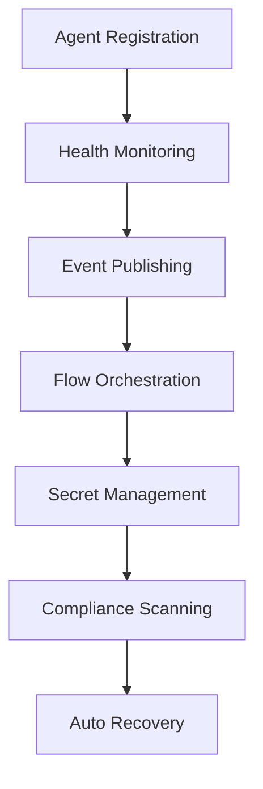

# YUR Agent Framework 🤖

[](../LICENSE)
[](https://www.typescriptlang.org/)
[](https://nodejs.org/)

Production-ready agent framework with health monitoring, self-registration, permissions, flow control, event-driven orchestration, and comprehensive security features.

## 🌟 Features

### 1. Agent Health API ✅
All agents implement a standardized `health()` method returning `{ healthy: boolean, reason?: string }` with detailed metrics, enabling universal monitoring and auto-recovery systems.

### 2. Agent Self-Registration ✅
On startup, agents automatically register themselves in a central registry with both in-memory and persistent file storage, enabling plugin architectures and hot-reload capabilities.

### 3. Agent Permissions/Sandboxing ✅
Agents declare and enforce allowed tasks, secrets, and event topics. The central runtime denies unauthorized actions and maintains comprehensive audit logs of violations.

### 4. Conditional/Dynamic Flow Steps ✅
Flow runner supports if/else conditions, retries with exponential backoff, branching logic, and looping constructs. YAML/JSON flows can express complex conditions, guards, and dynamic branching.

### 5. Output Piping ✅
Flow runner enables later steps to reference outputs of previous steps using `{{steps.myStep.result}}` syntax, enabling complex, data-driven agent pipelines.

### 6. Event-Driven Orchestration ✅
OrchestratorAgent listens for events (e.g., `build.failed`) and triggers flows automatically with full event-bus integration and topic-based routing.

### 7. Per-Secret Access Controls ✅
SecretsAgent enforces granular per-agent access control with comprehensive audit logging of all secret reads/writes, automatically denying violations.

### 8. Secrets Scanning ✅
ComplianceAgent scans repositories and PRs for leaked secrets using advanced pattern matching, integrates with RecoveryAgent for automatic secret rotation upon detection.

### 9. Agent Authentication ✅
Every agent signs actions/events with RSA cryptographic keys, ensuring all actions/events are verifiably attributable and tamper-proof.

## 🚀 Quick Start

### Installation

```bash
# Install the framework
npm install @yur/agent-framework

# Or clone and build from source
git clone https://github.com/IAmCarnell/YUR.git
cd YUR/agents
npm install && npm run build
```

### Basic Usage

```typescript
import { YURAgentFramework, BaseAgent } from '@yur/agent-framework';

// Create custom agent
class MyAgent extends BaseAgent {
  constructor() {
    super('my-agent', 'My Agent', 'worker', {
      allowedTasks: ['processData', 'validateInput'],
      allowedSecrets: ['api.*'],
      allowedEventTopics: ['data.*']
    });
  }

  protected async onInitialize(): Promise<void> {
    console.log('Agent initialized');
  }

  protected async onExecuteTask(task: AgentTask): Promise<any> {
    return { result: 'Task completed' };
  }

  // ... implement other required methods
}

// Initialize and start framework
const framework = new YURAgentFramework();
await framework.start();

// Register your agent
const myAgent = new MyAgent();
await framework.registerAgent(myAgent);

// Framework automatically handles health monitoring, 
// event routing, and orchestration
```

## 🏗️ Architecture

### Core Components

```
YUR Agent Framework
├── 🎯 Agent Registry         # Self-registration & discovery
├── ⚡ Flow Runner           # Conditional execution engine  
├── 📡 Event Bus             # Topic-based event routing
├── 🔐 Secrets Agent         # Encrypted secrets management
├── 🔍 Compliance Agent      # Secret scanning & recovery
├── 🎼 Orchestrator Agent    # Event-driven coordination
├── 🛡️ Security Layer        # Authentication & permissions
└── 🏗️ Infrastructure        # Advanced production modules
    ├── 🌐 Distributed Registry    # Multi-node agent registry
    ├── 📋 Policy Engine          # OPA/Rego policy enforcement
    ├── 📊 Event Streaming        # Persistent event logs
    ├── 📈 Metrics Collection     # Prometheus/OpenTelemetry
    ├── 🔑 Secure Key Manager     # HSM/KMS-style key management
    ├── 🛡️ Secrets ACL           # Fine-grained access control
    ├── 🔍 Secret Scanner         # Advanced pattern detection
    └── ⚙️ Advanced Flow Runner   # Dynamic workflow engine
```

### Framework Workflow



## 🏗️ Advanced Infrastructure Modules

The YUR Agent Framework includes production-grade infrastructure modules that provide enterprise-level capabilities for distributed systems, security, and observability.

### 🌐 Distributed Agent Registry (`infra/registry.ts`)

Enterprise-grade distributed registry with consensus, health monitoring, and automatic failover.

**Features:**
- **Multi-node Distribution**: Automatic cluster formation and consensus
- **Health Monitoring**: Real-time agent health with configurable checks
- **Auto-discovery**: Gossip protocol for node discovery
- **Persistent Storage**: Replicated state with consistency guarantees
- **Leader Election**: Automatic leader election for coordination

```typescript
import { DistributedAgentRegistry } from '@yur/agent-framework/infra';

const registry = new DistributedAgentRegistry({
  nodeId: 'node-1',
  bindPort: 8500,
  seedNodes: ['node-2:8500', 'node-3:8500'],
  replicationFactor: 3,
  enableGossip: true
});

await registry.start();

// Register agent across cluster
await registry.register({
  id: 'my-agent',
  name: 'Production Agent',
  type: 'worker',
  capabilities: ['process-data', 'validate-input'],
  // ... other registration details
});

// Get cluster status
const status = registry.getClusterStatus();
console.log(`Cluster size: ${status.clusterSize}, Healthy nodes: ${status.healthyNodes}`);
```

### 📋 Policy Engine (`infra/policy.ts`)

OPA/Rego-compatible policy engine with hot-reloading and decision caching.

**Features:**
- **Rego Policies**: OPA-compatible policy language
- **Hot Reload**: Automatic policy updates without restart
- **Decision Caching**: High-performance policy evaluation
- **Audit Logging**: Complete decision audit trail
- **Context-aware**: Rich evaluation context

```typescript
import { PolicyEngine } from '@yur/agent-framework/infra';

const policyEngine = new PolicyEngine({
  policyDir: './policies',
  enableHotReload: true,
  enableCaching: true,
  cacheTtlSeconds: 300
});

await policyEngine.start();

// Add policy
await policyEngine.addPolicy({
  id: 'agent-access-policy',
  name: 'Agent Access Control',
  package: 'agent.access',
  rego: `
    package agent.access
    
    allow = true {
      input.agent.type == "trusted"
      input.resource.sensitivity != "high"
    }
    
    deny = true {
      input.agent.permissions[_] == "restricted"
    }
  `,
  enabled: true,
  priority: 100
});

// Evaluate policy
const decision = await policyEngine.evaluate('agent.access', {
  input: {
    agent: { id: 'agent-1', type: 'trusted' },
    resource: { id: 'secret-1', sensitivity: 'medium' }
  },
  action: 'read'
});

console.log(`Access ${decision.allow ? 'granted' : 'denied'}: ${decision.reasons.join(', ')}`);
```

### 📊 Event Streaming (`infra/events.ts`)

Persistent, append-only event log with partitioning and real-time streaming.

**Features:**
- **Append-only Log**: Immutable event history
- **Partitioning**: Horizontal scaling with consistent hashing
- **Compression**: Configurable compression for storage efficiency
- **Replication**: Multi-replica consistency
- **Transactions**: ACID transaction support

```typescript
import { PersistentEventBus } from '@yur/agent-framework/infra';

const eventBus = new PersistentEventBus({
  dataDir: './event-logs',
  partitionCount: 8,
  compressionEnabled: true,
  replicationFactor: 3,
  enableTransactions: true
});

await eventBus.start();

// Publish single event
const event = await eventBus.publish(
  'agent.lifecycle',
  'agent_registered',
  { agentId: 'agent-1', timestamp: new Date() },
  { source: 'registry' },
  'system'
);

// Publish batch with transaction
const events = await eventBus.publishBatch([
  { topic: 'data.processing', eventType: 'job_started', data: { jobId: '123' } },
  { topic: 'data.processing', eventType: 'job_progress', data: { jobId: '123', progress: 0.5 } }
], 'worker-agent');

// Subscribe to events
await eventBus.subscribe(
  'subscriber-1',
  'agent.*',
  async (event) => {
    console.log(`Received event: ${event.eventType}`, event.data);
  },
  { startOffset: 0 } // Replay from beginning
);
```

### 📈 Metrics Collection (`infra/metrics.ts`)

Prometheus/OpenTelemetry compatible metrics with distributed tracing.

**Features:**
- **Prometheus Format**: Compatible with Prometheus scraping
- **OpenTelemetry**: Distributed tracing support
- **Custom Metrics**: Counters, gauges, histograms, summaries
- **Built-in Metrics**: Framework and system metrics
- **HTTP Endpoint**: /metrics endpoint for scraping

```typescript
import { MetricsCollector } from '@yur/agent-framework/infra';

const metrics = new MetricsCollector({
  serviceName: 'yur-agent-framework',
  metricsPort: 9090,
  enablePrometheus: true,
  enableTracing: true
});

await metrics.start();

// Create custom metrics
const requestCounter = metrics.createCounter(
  'http_requests_total',
  'Total HTTP requests',
  ['method', 'status']
);

const responseTime = metrics.createHistogram(
  'http_request_duration_seconds',
  'HTTP request duration',
  ['method', 'endpoint']
);

// Use metrics
requestCounter.inc(1, { method: 'GET', status: '200' });
responseTime.observe(0.123, { method: 'GET', endpoint: '/api/agents' });

// Start tracing span
const span = metrics.startSpan('process_request', {
  'http.method': 'POST',
  'http.url': '/api/flows'
});

try {
  // Process request
  await processRequest();
  span.setStatus('ok');
} catch (error) {
  span.setStatus('error').setTag('error.message', error.message);
} finally {
  span.finish();
  metrics.recordTrace(span.getTrace());
}
```

### 🔑 Secure Key Manager (`infra/secure-keys.ts`)

HSM/KMS-style cryptographic key management with hardware security features.

**Features:**
- **Key Generation**: RSA, EC, AES, HMAC key generation
- **Secure Storage**: Encrypted key storage with master key
- **Key Rotation**: Automatic and manual key rotation
- **Access Control**: Fine-grained key access permissions
- **Audit Logging**: Complete key usage audit trail

```typescript
import { SecureKeyManager } from '@yur/agent-framework/infra';

const keyManager = new SecureKeyManager({
  keyStoreDir: './secure-keys',
  masterKeyPath: './master.key',
  enableAuditLogging: true,
  backupEnabled: true
});

await keyManager.initialize();

// Create signing key
const keyId = await keyManager.createKey(
  'agent-signing-key',
  'rsa',
  'signing',
  {
    keySize: 2048,
    algorithm: 'RS256',
    rotationPolicy: {
      maxAge: 86400000 * 30, // 30 days
      maxUsage: 10000,
      autoRotate: true
    },
    agentId: 'system'
  }
);

// Grant access to agent
await keyManager.grantKeyAccess(
  keyId,
  'agent-1',
  ['sign'],
  {
    maxUsesPerHour: 100,
    timeWindow: { start: '09:00', end: '17:00' }
  }
);

// Sign data
const signature = await keyManager.sign({
  keyId,
  data: 'Hello, World!',
  agentId: 'agent-1',
  purpose: 'message-authentication'
});

console.log(`Signature: ${signature.signature}`);
```

### 🛡️ Secrets ACL (`infra/secrets-acl.ts`)

Fine-grained access control for secrets with dynamic conditions and approval workflows.

**Features:**
- **Per-Secret Rules**: Individual access rules per secret
- **Dynamic Conditions**: Time windows, IP restrictions, rate limits
- **Approval Workflows**: Multi-step approval for sensitive operations
- **Role-based Access**: Group and role-based permissions
- **Comprehensive Audit**: Complete access decision logging

```typescript
import { SecretsACL } from '@yur/agent-framework/infra';

const secretsACL = new SecretsACL({
  dataDir: './secrets-acl',
  enableApprovalWorkflow: true,
  enableMFA: true,
  enableRateLimiting: true
});

await secretsACL.initialize();

// Create role
const roleId = await secretsACL.createRole({
  name: 'Database Administrator',
  description: 'Full database access',
  permissions: {
    secretPatterns: ['database.*'],
    actions: ['read', 'write', 'rotate'],
    conditions: [{
      type: 'time_window',
      parameters: { startTime: '09:00', endTime: '17:00' }
    }]
  },
  createdBy: 'admin'
});

// Add access rule
const ruleId = await secretsACL.addAccessRule({
  secretId: 'database-password',
  principal: { type: 'agent', identifier: 'db-agent' },
  permissions: [{
    action: 'read',
    conditions: [{
      type: 'ip_whitelist',
      parameters: { allowedIps: ['10.0.0.0/8'] }
    }, {
      type: 'rate_limit',
      parameters: { requests: 10, windowMs: 60000 }
    }]
  }],
  priority: 100,
  enabled: true,
  createdBy: 'admin'
});

// Check access
const decision = await secretsACL.checkAccess({
  requestId: 'req-123',
  secretId: 'database-password',
  agentId: 'db-agent',
  action: 'read',
  purpose: 'database-connection',
  environment: 'production',
  sourceIp: '10.0.1.100',
  timestamp: new Date()
});

console.log(`Access ${decision.allow ? 'granted' : 'denied'}: ${decision.reasons.join(', ')}`);
```

### 🔍 Secret Scanner (`infra/secret-scanner.ts`)

Advanced secret detection with pattern matching, entropy analysis, and context awareness.

**Features:**
- **Pattern Library**: 8+ built-in secret patterns (AWS, GitHub, etc.)
- **Entropy Analysis**: Statistical analysis for generic secrets
- **Context Awareness**: File type and location context
- **Custom Patterns**: User-defined detection patterns
- **Batch Processing**: Directory and repository scanning

```typescript
import { SecretScanner } from '@yur/agent-framework/infra';

const scanner = new SecretScanner({
  patternsDir: './secret-patterns',
  enableEntropyAnalysis: true,
  enableContextAnalysis: true,
  confidenceThreshold: 0.8,
  reportingEnabled: true
});

await scanner.initialize();

// Add custom pattern
await scanner.addPattern({
  id: 'custom-api-key',
  name: 'Custom API Key',
  description: 'Organization-specific API key format',
  category: 'api_key',
  severity: 'high',
  regex: /CUST_[A-Z0-9]{32}/,
  keywords: ['custom', 'api', 'key'],
  entropy: { threshold: 4.0, algorithm: 'shannon' },
  enabled: true,
  falsePositiveFilters: []
});

// Scan directory
const result = await scanner.scanDirectory('./my-project');

console.log(`Scan Results:
  Files Scanned: ${result.summary.scannedFiles}
  Secrets Found: ${result.summary.totalSecrets}
  Critical: ${result.summary.criticalSecrets}
  High: ${result.summary.highSecrets}
`);

// Examine secrets
for (const secret of result.secrets) {
  console.log(`
    Pattern: ${secret.patternName}
    File: ${secret.location.filePath}:${secret.location.line}
    Confidence: ${(secret.confidence * 100).toFixed(1)}%
    Remediation: ${secret.remediation.urgency} priority
  `);
}
```

### ⚙️ Advanced Flow Runner (`infra/flow-runner-advanced.ts`)

Sophisticated workflow engine with loops, parallel execution, and dynamic conditions.

**Features:**
- **Advanced Control Flow**: Loops (for/while/foreach), parallel branches
- **Dynamic Conditions**: Runtime expression evaluation
- **Variable Scoping**: Global, local, and step-scoped variables
- **Subprocess Support**: Nested workflow execution
- **Resource Management**: Memory and CPU limits
- **Comprehensive Tracing**: Detailed execution traces

```typescript
import { AdvancedFlowRunner } from '@yur/agent-framework/infra';

const flowRunner = new AdvancedFlowRunner({
  dataDir: './flow-data',
  maxConcurrentExecutions: 10,
  enableScheduling: true,
  enableTracing: true
});

await flowRunner.initialize();

// Define advanced flow
const flowDefinition = {
  id: 'data-processing-pipeline',
  name: 'Advanced Data Processing',
  version: '2.0.0',
  inputs: [
    { name: 'dataset', type: 'array', value: [] },
    { name: 'batchSize', type: 'number', value: 100 }
  ],
  steps: [
    // Parallel processing
    {
      id: 'parallel-processing',
      name: 'Process Data in Parallel',
      type: 'parallel',
      parallel: {
        branches: [
          [{ id: 'validate', type: 'action', agentId: 'validator', action: 'validate' }],
          [{ id: 'transform', type: 'action', agentId: 'transformer', action: 'transform' }],
          [{ id: 'enrich', type: 'action', agentId: 'enricher', action: 'enrich' }]
        ],
        waitForAll: true,
        maxConcurrency: 3
      }
    },
    // Loop processing
    {
      id: 'batch-processing',
      name: 'Process Data in Batches',
      type: 'loop',
      loop: {
        type: 'for',
        iterable: '${variables.dataset}',
        maxIterations: 1000,
        body: [
          {
            id: 'process-batch',
            type: 'action',
            agentId: 'processor',
            action: 'processBatch',
            inputs: { 
              item: '${loop_item}',
              index: '${loop_index}'
            }
          }
        ]
      }
    },
    // Conditional step
    {
      id: 'quality-check',
      name: 'Quality Assurance',
      type: 'condition',
      condition: {
        expression: 'steps.batch-processing.result.errors < 5'
      },
      onTrue: [
        { id: 'finalize', type: 'action', agentId: 'finalizer', action: 'finalize' }
      ],
      onFalse: [
        { id: 'retry', type: 'action', agentId: 'processor', action: 'retry' }
      ]
    }
  ],
  config: {
    timeout: 600000, // 10 minutes
    errorHandling: 'collect',
    enableTracing: true
  }
};

await flowRunner.registerFlow(flowDefinition);

// Execute flow
const executionId = await flowRunner.executeFlow(
  'data-processing-pipeline',
  { 
    dataset: [1, 2, 3, 4, 5],
    batchSize: 2
  }
);

// Monitor execution
const execution = flowRunner.getExecution(executionId);
console.log(`Execution status: ${execution?.status}`);
console.log(`Steps executed: ${execution?.metrics.stepsExecuted}`);
```

## 🔧 Infrastructure Configuration

All infrastructure modules are highly configurable and designed for production environments:

```typescript
// Complete infrastructure setup
import { 
  DistributedAgentRegistry,
  PolicyEngine,
  PersistentEventBus,
  MetricsCollector,
  SecureKeyManager,
  SecretsACL,
  SecretScanner,
  AdvancedFlowRunner
} from '@yur/agent-framework/infra';

// Configure all infrastructure components
const infrastructure = {
  registry: new DistributedAgentRegistry({
    nodeId: process.env.NODE_ID || 'node-1',
    bindPort: 8500,
    seedNodes: process.env.SEED_NODES?.split(',') || [],
    replicationFactor: 3
  }),
  
  policy: new PolicyEngine({
    policyDir: './policies',
    enableHotReload: true,
    enableCaching: true
  }),
  
  events: new PersistentEventBus({
    dataDir: './event-logs',
    partitionCount: 8,
    compressionEnabled: true
  }),
  
  metrics: new MetricsCollector({
    serviceName: 'yur-framework',
    metricsPort: 9090,
    enablePrometheus: true
  }),
  
  keyManager: new SecureKeyManager({
    keyStoreDir: './keys',
    enableAuditLogging: true,
    backupEnabled: true
  }),
  
  secretsACL: new SecretsACL({
    enableApprovalWorkflow: true,
    enableMFA: true
  }),
  
  scanner: new SecretScanner({
    enableEntropyAnalysis: true,
    confidenceThreshold: 0.8
  }),
  
  flowRunner: new AdvancedFlowRunner({
    maxConcurrentExecutions: 20,
    enableScheduling: true
  })
};

// Initialize all components
for (const [name, component] of Object.entries(infrastructure)) {
  await component.initialize();
  console.log(`✅ ${name} initialized`);
}
```

### Health Monitoring System
- **Real-time Health Checks**: 30-second intervals with configurable timeout
- **Detailed Metrics**: CPU, memory, uptime, error tracking
- **Auto-recovery**: Automatic restart on health failures
- **Dashboard Integration**: Visual health status for all agents

### Self-Registration System
- **Persistent Registry**: JSON file + in-memory for performance
- **Heartbeat Monitoring**: Automatic cleanup of stale agents
- **Hot Reload**: Dynamic agent loading/unloading
- **Capability Discovery**: Automatic service discovery

### Permission System
- **Task-level Permissions**: Granular control over agent actions
- **Secret Access Control**: Per-agent secret access with audit trails
- **Event Topic Filtering**: Publish/subscribe permission enforcement
- **Rate Limiting**: Configurable request throttling

### Flow Control Engine
- **Conditional Logic**: if/else branching with expression evaluation
- **Retry Mechanisms**: Linear and exponential backoff strategies
- **Output Piping**: `{{steps.stepId.result}}` variable substitution
- **Parallel Execution**: Concurrent step processing
- **Loop Support**: Iteration with break conditions

### Event-Driven Architecture
- **Topic Routing**: Hierarchical topic matching with wildcards
- **Event History**: Persistent event log with replay capability
- **Signature Verification**: Cryptographic event authentication
- **Auto-orchestration**: Event triggers for workflow automation

### Security Framework
- **RSA Key Pairs**: 2048-bit cryptographic signatures
- **Audit Logging**: Comprehensive access logs with timestamps
- **Secret Scanning**: 8+ secret pattern types with confidence scoring
- **Auto-rotation**: Triggered secret rotation on leak detection

## 📋 Production Features

### Framework Configuration

```typescript
const framework = new YURAgentFramework({
  registry: {
    persistent: true,
    filePath: './agent-registry.json',
    cleanupInterval: 30000
  },
  security: {
    enableAuthentication: true,
    keySize: 2048,
    signatureAlgorithm: 'RS256'
  },
  health: {
    checkInterval: 30000,
    timeout: 5000,
    retries: 3
  },
  flows: {
    maxConcurrentExecutions: 10,
    defaultTimeout: 300000,
    enableLogging: true
  },
  events: {
    maxHistorySize: 10000,
    enablePersistence: true
  }
});
```

### Agent Permissions

```typescript
const permissions: AgentPermissions = {
  allowedTasks: ['processData', 'validateInput', 'exportResults'],
  allowedSecrets: ['database.*', 'api.external.*'],
  allowedEventTopics: ['data.*', 'processing.status'],
  maxConcurrentTasks: 5,
  rateLimit: {
    requests: 100,
    windowMs: 60000
  }
};
```

## 🎯 Flow Definitions

### Conditional Flow Example

```typescript
const flowDefinition: FlowDefinition = {
  id: 'data-processing-flow',
  name: 'Data Processing Pipeline',
  version: '1.0.0',
  steps: [
    {
      id: 'validate',
      name: 'Validate Input',
      type: 'task',
      agent: 'validator-agent',
      action: 'validateData',
      parameters: { data: '{{variables.inputData}}' }
    },
    {
      id: 'check-validation',
      name: 'Check Validation Result',
      type: 'condition',
      condition: {
        expression: 'steps.validate.result.valid == true',
        onTrue: 'process-data',
        onFalse: 'handle-error'
      }
    },
    {
      id: 'process-data',
      name: 'Process Valid Data',
      type: 'task',
      agent: 'processor-agent',
      action: 'processData',
      parameters: {
        validatedData: '{{steps.validate.result}}'
      },
      retry: {
        maxAttempts: 3,
        backoff: 'exponential',
        delay: 1000
      }
    }
  ]
};
```

## 🔍 Secret Scanning

### Built-in Patterns
- AWS Access Keys & Secret Keys
- GitHub Personal Access Tokens
- OpenAI API Keys
- Generic API Keys
- Database Passwords
- JWT Tokens
- SSH Private Keys
- Custom Pattern Support

### Scanning Example

```typescript
const { complianceScanner } = framework.getComponents();

// Scan content for secrets
const result = await complianceScanner.scanForSecrets(
  'const API_KEY = "sk-1234567890abcdef"',
  'config.js'
);

// Scan entire repository
const repoScan = await complianceScanner.scanRepository('./my-project');

// Scan pull request diff
const prScan = await complianceScanner.scanPullRequest('123');
```

## 📡 Event-Driven Orchestration

### Orchestration Rules

```typescript
const rule: OrchestrationRule = {
  id: 'build-failure-recovery',
  name: 'Build Failure Auto-Recovery',
  enabled: true,
  triggers: [{
    id: 'build-failed',
    name: 'Build Failed Event',
    eventType: 'build:failed',
    eventTopic: 'ci.builds',
    condition: 'event.data.severity == "high"',
    flowId: 'recovery-flow'
  }],
  flowDefinition: {
    // Recovery flow definition
  }
};
```

## 📊 Monitoring & Statistics

### Framework Statistics

```typescript
const stats = framework.getStats();
console.log({
  totalAgents: stats.totalAgents,
  activeAgents: stats.activeAgents,
  totalEvents: stats.totalEvents,
  secretsAccessed: stats.secretsAccessed,
  securityViolations: stats.securityViolations,
  uptime: stats.uptime
});
```

### Health Dashboard

```typescript
const health = await framework.healthCheck();
console.log({
  healthy: health.healthy,
  components: health.components,
  agents: health.agents
});
```

## 🔒 Security Best Practices

### Agent Development
1. **Minimal Permissions**: Only request necessary permissions
2. **Input Validation**: Validate all task parameters
3. **Error Handling**: Graceful failure with detailed logging
4. **Health Checks**: Implement comprehensive health validation

### Secret Management
1. **Encryption at Rest**: All secrets encrypted with AES-256
2. **Access Logging**: Complete audit trail for compliance
3. **Rotation Policies**: Automated rotation on compromise
4. **Least Privilege**: Per-agent access controls

### Flow Security
1. **Expression Sandboxing**: Safe evaluation of conditions
2. **Timeout Enforcement**: Prevent runaway executions
3. **Resource Limits**: Memory and CPU constraints
4. **Audit Trails**: Complete execution logging

## 🧪 Testing

### Run Tests

```bash
# Run all tests
npm test

# Run specific test files
npm test -- --grep "Agent Registry"

# Run with coverage
npm run test:coverage
```

### Example Test

```typescript
import { YURAgentFramework } from '@yur/agent-framework';

describe('Agent Framework', () => {
  let framework: YURAgentFramework;

  beforeEach(async () => {
    framework = new YURAgentFramework();
    await framework.start();
  });

  afterEach(async () => {
    await framework.stop();
  });

  it('should register and health check agents', async () => {
    const agent = new TestAgent();
    await framework.registerAgent(agent);
    
    const health = await framework.healthCheck();
    expect(health.healthy).toBe(true);
  });
});
```

## 📚 Examples

See the [examples directory](./examples/) for complete working examples:

- **[Basic Usage](./examples/basic-usage.ts)**: Complete framework demonstration
- **Custom Agents**: Building specialized agents
- **Flow Orchestration**: Complex workflow examples
- **Security Integration**: Authentication and permissions

## 🤝 Contributing

1. Fork the repository
2. Create a feature branch: `git checkout -b feature/amazing-feature`
3. Make your changes with tests
4. Run the test suite: `npm test`
5. Commit your changes: `git commit -m 'Add amazing feature'`
6. Push to the branch: `git push origin feature/amazing-feature`
7. Open a Pull Request

## 📄 License

This project is licensed under the BSD 3-Clause License - see the [LICENSE](../LICENSE) file for details.

## 🔗 Links

- **[YUR Framework](../README.md)**: Main framework documentation
- **[GitHub Repository](https://github.com/IAmCarnell/YUR)**: Source code and issues
- **[API Documentation](./dist/index.d.ts)**: TypeScript type definitions
- **[Examples](./examples/)**: Working code examples

---

**Built with ∞ by the YUR community** | *Production-ready agent orchestration for infinite possibilities*